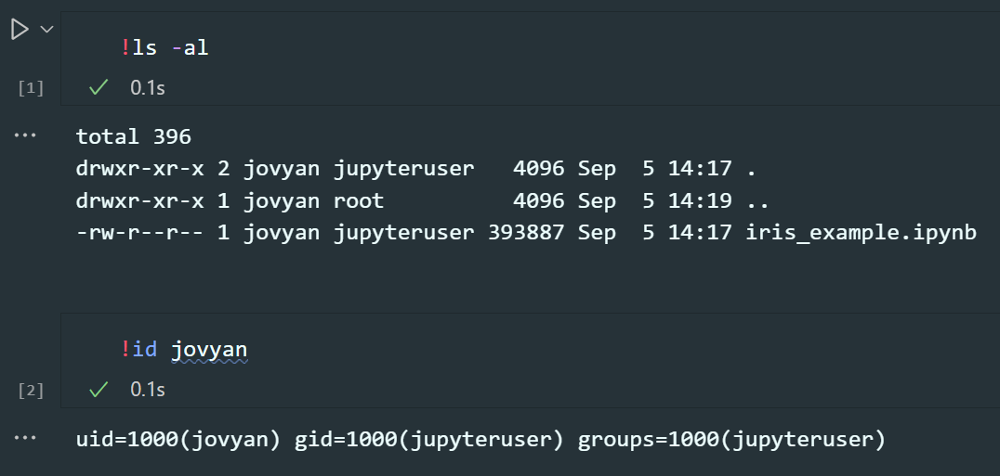

+++
title = "Mastering Dockerized Jupyter: A Secure, Reproducible, and Efficient Data Science Workflow"
date = 2024-03-19
tags = ["Docker", "Jupyter", "Data Science", "DevOps", "Python"]
+++


In the world of data science, where the intersection of sensitive information and the need for smooth collaboration is crucial, Dockerized Jupyter emerges as a valuable solution. Imagine this scenario: you're entrusted with confidential data and are required to work within a secure virtual environment. Time is of the essence, and ensuring the reproducibility of your results is vital. But how can you navigate this complex terrain?

Say goodbye to the challenges of version conflicts and the time-consuming setup procedures. Instead, adopt a streamlined approach to your workflow, enabling you to focus your efforts on gaining profound insights from your data.

In the following discussion, we will explore the common pitfalls often found in many Jupyter Dockerization guides. We will also delve into the finer details of securing and optimizing your Jupyter environment, ensuring that every data scientist can harness the benefits of Docker while maintaining data integrity and security.

The accompanying Github repo for this article can be found [here](https://github.com/okwilkins/jupyter-docker-example). You can take this away and use it how you like!

## Another Article Dockerizing Jupyter?

I recently undertook the task of Dockerizing Jupyter, applying it within my secure workflow. I thought that this would be a trivial task. ***Oh how I was wrong!*** Upon applying the contents of many different articles, I hit a few common problems. These problems rendered the articles unsuitable for my workflow.

I needed Jupyter to run securely, run on a virtual machine and to run alongside other Docker services.

## Running Jupyter Securely

```docker
FROM jupyter/tensorflow-notebook
WORKDIR /app
COPY . .
USER root
RUN chmod -R 777 /app
```

```docker
FROM python: <version>
WORKDIR /app
COPY . /app
RUN pip --no-cache-dir install numpy pandas seaborn sklearn jupyter
EXPOSE 8888
CMD ["jupyter", "notebook", "--ip='*'", "--port=8888", "--no-browser", "--allow-root"]
```

Spot the mistakes made in both Docker files. The eagle-eyed among you may have noticed that both Dockerfiles run the container as root.

Running a Docker container as the root user, especially when using volumes, poses a significant security risk because it allows the container to potentially manipulate or access sensitive host system files and directories, leading to data leakage, unauthorized modifications, and overall system vulnerabilities. **This will be of particular concern when working with sensitive data!**

Cast your eye to the bottom of this [Dockerfile that I prepared](https://github.com/okwilkins/jupyter-docker-example/blob/main/Dockerfile).

```docker
...
RUN chown -R ${JUPYTER_USERNAME} /home/${JUPYTER_USERNAME}
USER ${JUPYTER_USERNAME}
EXPOSE 8888
```

Note that the user is switched out from being root. Furthermore, the [docker-compose.yml file](https://github.com/okwilkins/jupyter-docker-example/blob/main/docker-compose.yml) doesn't use the `--allow-root` flag when running the Jupyter command.

## Using Volumes With Jupyter On A Virtual Machine


There is a very high likelyhood that many of you run VS Code as your editor of choice when working with Jupyter notebooks. If you haven't tried it already, give it a whirl!

I wanted the Jupyter server to directly plug into my file system, as you see it on the left in the picture above. This is where volumes can be leveraged.

Taking a look at the [supplied docker-compose.yml file](https://github.com/okwilkins/jupyter-docker-example/blob/main/docker-compose.yml) again, you can see that the data and notebook folders are being mirrored in the Docker container.

```yml
...
volumes:
  - ./data:/home/${JUPYTER_USERNAME}/data:rw
  - ./notebooks:/home/${JUPYTER_USERNAME}/notebooks:rw
```

There is a potential issue that stops these volumes being written to however! Take the following example:
On the virtual machine, here is a print out of the owner of each file:

```console
oli@ssh-machine:~/jupyter-docker-example/notebooks$ ls -al
total 396
drwxr-xr-x 2 oli oli   4096 Sep  5 15:17 .
drwxr-xr-x 5 oli oli   4096 Sep  5 15:17 ..
-rw-r--r-- 1 oli oli 393887 Sep  5 15:17 iris_example.ipynb

oli@ssh-machine:~/jupyter-docker-example/notebooks$ id oli
uid=9999(oli) gid=9999(oli) groups=9999(oli)
```

In comparison, here are the same commands being run in a Jupyter notebook:



Note how the uids and gids between each system are different. In this case, you will find that saving to the data and notebook folders to be not be possible. To fix this, inside the [.env file](https://github.com/okwilkins/jupyter-docker-example/blob/main/sample.env) the uid and gid of the Jupyter user is configured.

```sh
JUPYTER_ENABLE_LAB=yes
JUPYTER_USERNAME=jovyan
JUPYTER_TOKEN=secret
JUPYTER_PORT=8888

# Ids for the Jupyter user
UID=1000
GID=1000
```

## Why Not Use Jupyter Stacks?

You may be wondering why [Jupyter stacks](https://medium.com/r?url=https%3A%2F%2Fgithub.com%2Fjupyter%2Fdocker-stacks) are not used. The simple reason is this: in order to change the uid/gid of the Jupyter user, you have to *run the container as root*. As mentioned above, this is removes itself from best security practices.

## Conclusion

In the quest to Dockerize Jupyter the right way, we've embarked on a journey that many data scientists can relate to. The need for secure, reproducible, and efficient data science workflows often clashes with the pitfalls of running Docker containers as root and the intricacies of handling volumes.

By dissecting common issues and presenting practical solutions, we've not only unlocked the power of Docker for Jupyter but also ensured that sensitive data remains secure. The key takeaways are:

1. **Security First**: Running Docker containers as root poses significant risks. As data scientists, we must prioritize security. Our approach, as demonstrated in the provided Dockerfile and docker-compose.yml, shifts the user away from root, enhancing the overall security of the environment.

2. **Effortless Volumes**: Leveraging volumes for seamless integration with your file system is a game-changer, especially when using Jupyter in tools like VS Code. Our configuration ensures that files are owned correctly, eliminating obstacles to data reading and writing.

3. **Balancing Security and Convenience**: While Jupyter stacks might seem appealing, they often come with limitations in user ID and group ID customization, requiring containers to run as root. Our approach strikes a balance, prioritizing security without sacrificing convenience.
